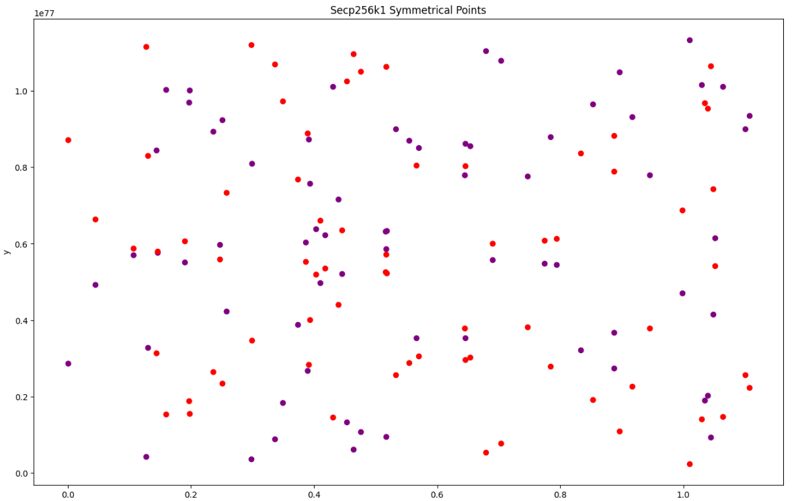

# Secp256k1 Symmetrical Points

This study demonstrates the symmetry created by the range of selected k values on the SECP256k1 curve.
If you move upward and downward from the half value of the curve's order parameter, the X-coordinates of the resulting points will be equal, creating a symmetry parallel to the X-axis.

Example values from the midpoint are as follows:

SECP256k1.order -->
115792089237316195423570985008687907852837564279074904382605163141518161494337

SECP256k1.order / 2 -->
k1 = 57896044618658097711785492504343953926418782139537452191302581570759080747168 - 1

k2 = 57896044618658097711785492504343953926418782139537452191302581570759080747169 + 1

K1: 57896044618658097711785492504343953926418782139537452191302581570759080747167

K2: 57896044618658097711785492504343953926418782139537452191302581570759080747170

R1: 89636686429439908262420422079980100111093242688153882571369946125714247242771

R2: 89636686429439908262420422079980100111093242688153882571369946125714247242771

R1hex: C62C910E502CB615A27C58512B6CC2C94F5742F76CB3D12EC993400A3695D413

R2hex: C62C910E502CB615A27C58512B6CC2C94F5742F76CB3D12EC993400A3695D413
